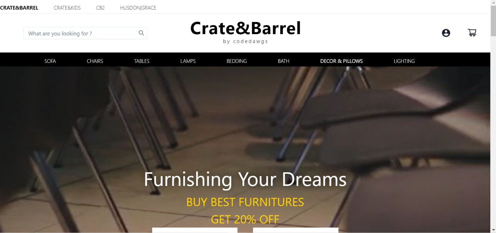
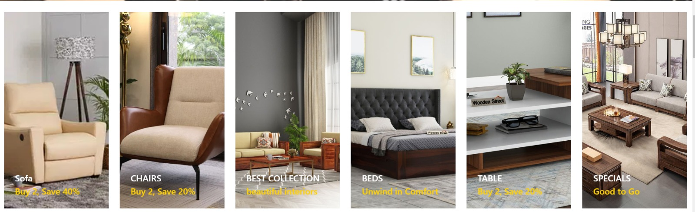
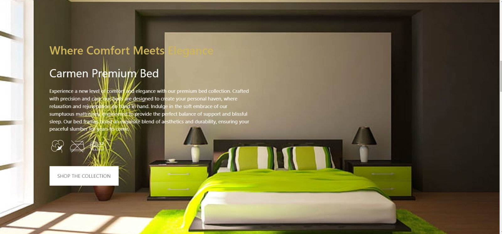

# [Crate&Barrel](link!!!)

We curate inspiration for the home, connecting the creative work
of artisans and designers to people and places around the world.

## Table of contents

- [Overview](#overview)
  - [About](#About)
  - [Screenshot](#screenshot)
  - [Links](#links)
- [Our process](#our-process)
  - [Built with](#built-with)
  - [Future work](#future-work)
- [Author](#author)

## Overview

### About

Our lifestyle brands offer inspired living through high-quality products, exclusive designs, and
timeless style - all powered by digital design and visualization tools that provide seamless shopping solutions in-store and online.

With a distinct architectural aesthetic, experiential store environment, and online community, we engage with our customers through social media, mobile shopping, design services, gift registry, and more.

- Regiseteration / logging-in system
- Shopping cart
- Product details
- Checkout process
- User account
- Search for products
- Filter products by price, categoty and brand
- Contact form

### Screenshot

Homepage

Signup Page

Signin Page

copy and upload screenshots!!

### Links

- live site: [link](link!!)
- frontend repo: [link](link!!)
- backend repo: [link](link!!)

## Our process

### Built with

- Semantic HTML5 markup
- CSS
- JavaScript
- Bootstrap
- React-Bootstrap
- React
- React-router
- Redux
- NodeJS
- Express
- MongoDB

### Future work

- Add a Wishlist
- Add to cart
- Loggin in / registering

## Author

Crate&Barrel is a Mean and Mern project built by a team of 6 aspiring developers:

- [Asif Ali Khan](https://github.com/Atenamus)
- [Abhijeet Das](https://github.com/Abhijeet2040)
- [Pradyumna Kumar Das](https://github.com/ghostgit26)
- [R Lalith](https://github.com/aaTma007)
- [Rojy Samal](https://github.com/RojySamal)
- [Rudra Prasad Muduli](https://github.com/rudra1011)

## Feedback

If you have any feedback, please reach out to us at jaha_bhi_lekhi_bara_achi@.com
